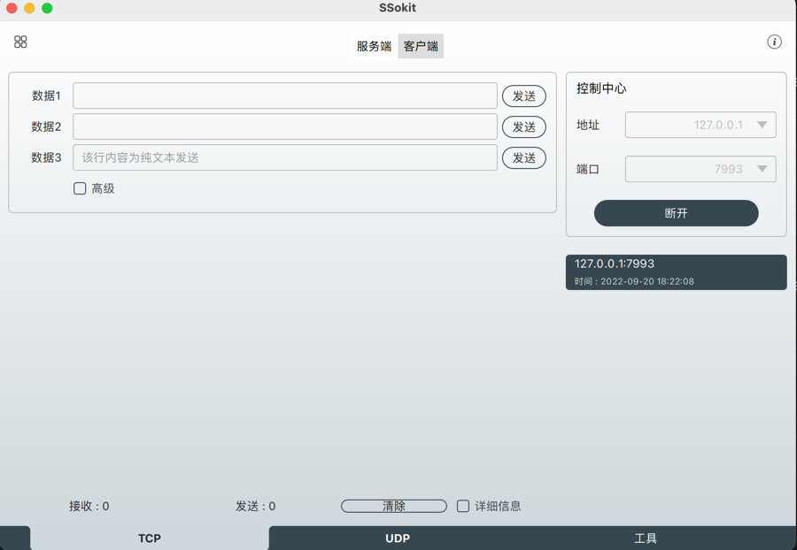
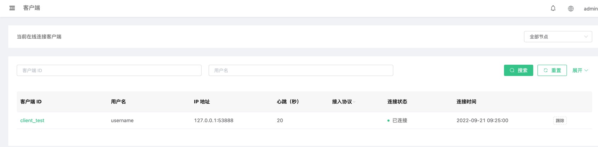
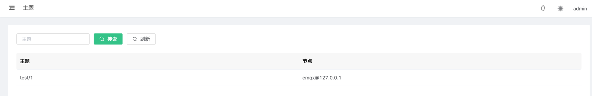
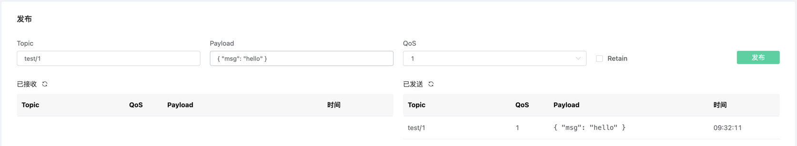
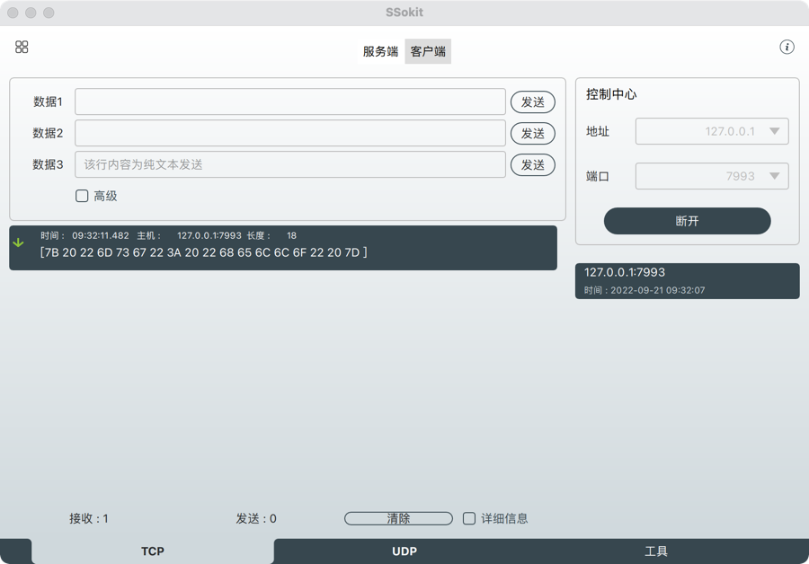
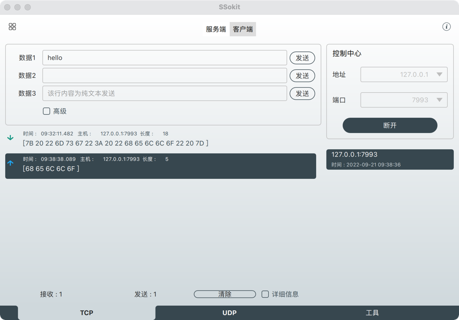
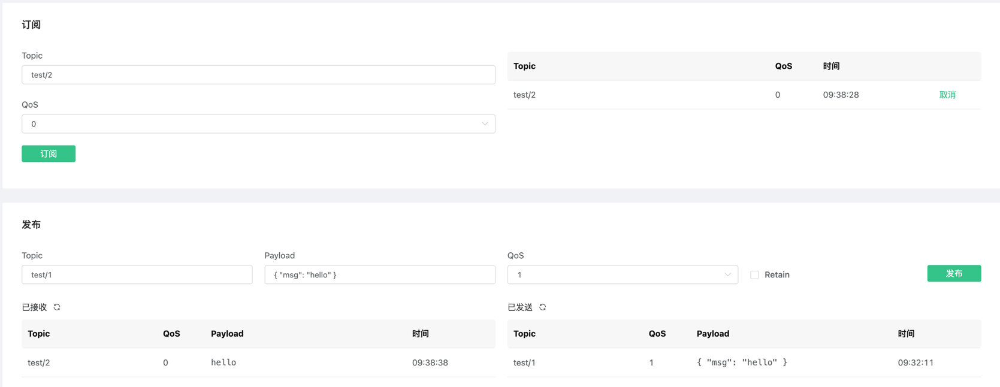

# Exproto-svr-go 快速指南

## 前提

1. 仅支持开源版 4.3+（本文档基于企业版 4.4.9）
2. 本项目默认你的机器已经安装 [GOLANG](https://golang.org) 环境，如果没有安装，请参考 [GOLANG 官方文档](https://golang.org/doc/install)。
3. 目前官方的 4.3.0-4.3.5 的版本尚存在 bug，需要补丁。以下是加入补丁之后的 Demo。
4. 如果你使用的时候，官方还没有修复 bug，可将[补丁](patch/grpc_client.beam) 放到你 EMQX 的 `lib/grpc-0.6.2/ebin` 下。

## 安装 protoc buffer

protoc buffer 各环境安装方式请参考 [protoc buffer 安装文档](https://developers.google.com/protocol-buffers/docs/downloads)。

## 安装 protoc-gen-go 和 protoc-gen-go-grpc 插件

- 使用以下命令安装插件
    ```bash
    export GO111MODULE=on  # Enable module mode
    go get -u google.golang.org/protobuf/cmd/protoc-gen-go
    go get -u google.golang.org/grpc/cmd/protoc-gen-go-grpc
    ```
- 设置PATH，以便协议编译器可以找到插件
  ```bash
  export PATH="$PATH:$(go env GOPATH)/bin"
  ```  

## 创建 GOLANG 项目

在你的工作空间 ,创建 GOLANG 项目，例如：`exproto-svr-go`, 并在该项目下创建 `protos` 文件夹 。

目录结构如下：

```
exproto-svr-go
├── protos
├── go.mod
└── main.go
```

## 导入官方的 exproto.proto

在此处获取: [exproto.proto](https://github.com/emqx/emqx/blob/main-v4.4/apps/emqx_exproto/priv/protos/exproto.proto) ，下载完之后复制到 `exproto-svr-go` 下的 `protos` 中

## 编译 exproto.proto

- 在 exproto.proto 文件中加入以下内容

    ```proto
    option go_package = "./";
    ```

- 在 `exproto-svr-go` 下执行以下命令，编译 `exproto.proto` 生成 `exproto.pb.go` 和 `exproto_grpc.pb.go` 。
  ```bash
  protoc --go_out=. --go_opt=paths=source_relative \                      
    --go-grpc_out=. --go-grpc_opt=paths=source_relative \
    protos/exproto.proto
  ```
- 编译成功后，会在 `protos` 下生成 `exproto.pb.go` 和 `exproto_grpc.pb.go`，结构如下。
  ```
  exproto-svr-go
  ├── protos
  │   ├── exproto.pb.go
  │   ├── exproto_grpc.pb.go
  │   └── exproto.proto
  ├── go.mod
  └── main.go
  ```

## 编写 GOLANG 代码

源码如下

```go
package main

import (
	"log"
	"net"

	"google.golang.org/grpc"

	pb "exproto-svr-go/protos"
)

const (
	port = ":9001"
)

type server struct {
	pb.ConnectionHandlerServer
}

var client pb.ConnectionAdapterClient

func (s *server) OnSocketCreated(in pb.ConnectionHandler_OnSocketCreatedServer) error {
	recv, err := in.Recv()
	if err != nil {
		log.Println("recv error:", err)
		return err
	}
	log.Println("[LOG] 客户端 SOCKET 连接")
	// EMQX 认证
	clientInfo := pb.ClientInfo{
		Clientid: "client_test",
		Username: "username",
	}
	auth := pb.AuthenticateRequest{
		Clientinfo: &clientInfo,
		Password:   "password",
		Conn:       recv.Conn,
	}
	response, err := client.Authenticate(in.Context(), &auth)
	if err != nil {
		log.Println("[LOG] EMQX 认证失败: ", err)
		return err
	}
	log.Println("[LOG] EMQX 认证成功: ", response)
	// 订阅主题
	subscribe := pb.SubscribeRequest{
		Topic: "test/1",
		Qos:   1,
		Conn:  recv.Conn,
	}
	response, err = client.Subscribe(in.Context(), &subscribe)
	if err != nil {
		log.Println("[LOG] 订阅主题失败: ", err)
		return err
	}
	log.Println("[LOG] 订阅主题成功: ", response)
	// 启动心跳检测
	timer := pb.TimerRequest{Conn: recv.Conn, Interval: 20, Type: pb.TimerType_KEEPALIVE}
	response, err = client.StartTimer(in.Context(), &timer)
	if err != nil {
		log.Println("[LOG] 启动心跳检测失败: ", err)
		return err
	}
	log.Println("[LOG] 启动心跳检测成功: ", response)
	return nil
}

func (s *server) OnReceivedBytes(in pb.ConnectionHandler_OnReceivedBytesServer) error {
	recv, err := in.Recv()
	if err != nil {
		log.Println("recv error:", err)
		return err
	}
	publish := pb.PublishRequest{
		Conn:    recv.Conn,
		Topic:   "test/2",
		Qos:     1,
		Payload: recv.GetBytes(),
	}
	response, err := client.Publish(in.Context(), &publish)
	if err != nil {
		log.Println("[LOG] 发布消息失败: ", err)
		return err
	}
	log.Println("[LOG] 客户端发送数据成功:", response.Code)
	return nil
}

func (s *server) OnSocketClosed(in pb.ConnectionHandler_OnSocketClosedServer) error {
	recv, err := in.Recv()
	if err != nil {
		log.Println("recv error:", err)
		return err
	}
	closeReq := pb.CloseSocketRequest{
		Conn: recv.Conn,
	}
	_, err = client.Close(in.Context(), &closeReq)
	if err != nil {
		log.Println("[LOG] 关闭连接失败: ", err)
		return err
	}
	log.Println("[LOG] 关闭连接成功")
	return nil
}

func (s *server) OnTimerTimeout(in pb.ConnectionHandler_OnTimerTimeoutServer) error {
	recv, err := in.Recv()
	if err != nil {
		log.Println("recv error:", err)
		return err
	}
	log.Println("[LOG] 客户端心跳超时")
	closeReq := pb.CloseSocketRequest{
		Conn: recv.Conn,
	}
	_, err = client.Close(in.Context(), &closeReq)
	log.Println("[LOG] 超时关闭连接")
	return nil
}

func (s *server) OnReceivedMessages(in pb.ConnectionHandler_OnReceivedMessagesServer) error {
	recv, err := in.Recv()
	if err != nil {
		log.Println("recv error:", err)
		return err
	}
	log.Println("[LOG] 客户端收到消息")
	sendReq := pb.SendBytesRequest{
		Conn:  recv.Conn,
		Bytes: recv.Messages[0].Payload,
	}
	response, err := client.Send(in.Context(), &sendReq)
	if err != nil {
		log.Println("[LOG] 发送消息失败: ", err)
		return err
	}
	log.Println("[LOG] 发送消息成功:", response.Code)
	return nil
}

func main() {
	lis, err := net.Listen("tcp", port)
	if err != nil {
		log.Fatalf("failed to listen: %v", err)
	}
	// 这里替换成你的EMQX的IP地址
	conn, err := grpc.Dial("127.0.0.1:9100", grpc.WithInsecure())
	if err != nil {
		log.Fatalf("did not connect: %v", err)
	}
	defer conn.Close()
	client = pb.NewConnectionAdapterClient(conn)
	s := grpc.NewServer()
	pb.RegisterConnectionHandlerServer(s, &server{})
	log.Println("Started gRPC server on ::9001")
	if err := s.Serve(lis); err != nil {
		log.Fatalf("failed to serve: %v", err)
	}
}
```

## 测试过程

我这里使用的 SSokit 进行的测试，EMQX 服务器的 IP 为 127.0.0.1

### 连接



连接之后可以看到控制台输出以下内容：


EMQX 查看客户端



EMQX 查看订阅信息



### 订阅收到信息

使用 EMQX websocket 向订阅主题方式消息



可以看到 ssokit 接收到消息




### 发送信息

使用 ssokit 向 websocket 订阅主题发送消息



可以看到 EMQX websocket 接收到消息




## 注意：这里的StartTimer官方文档写的开启心跳的定时器，其真实意义是如果监测到我们的tcp连接interval*3s没有发送数据，就会回调OnTimerTimeout函数，我们可以在这里处理一些业务，我这里将tcp连接直接踢掉。