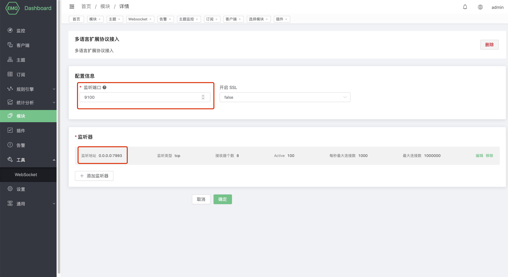
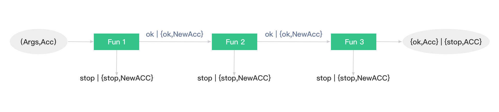
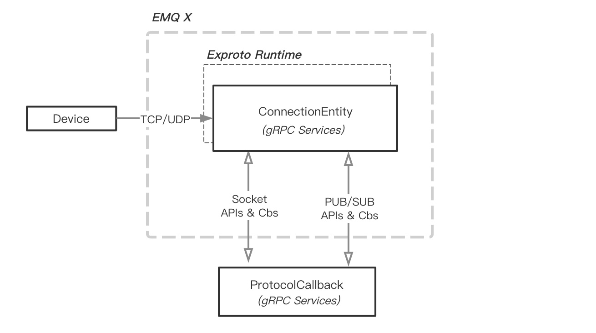
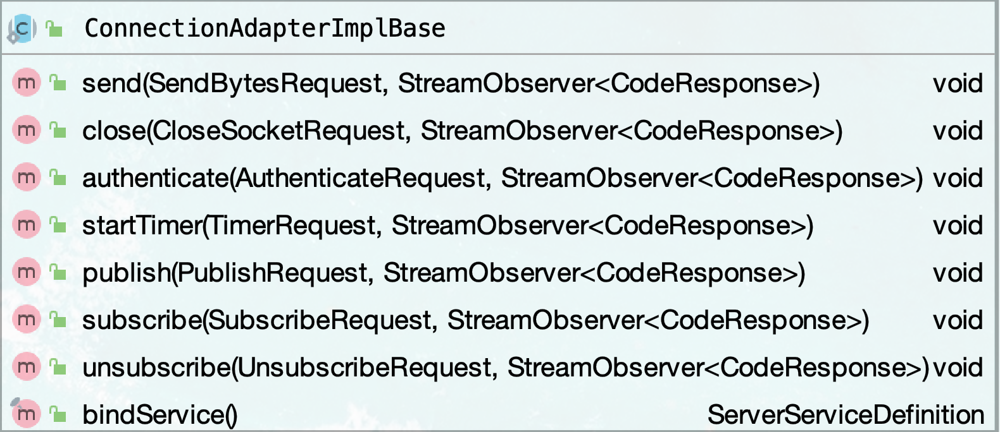

# Exproto-svr-java 快速指南

## 前提

1. 仅支持企业版 e4.2.5+。该项目基于企业版 e4.2.5+ 提供的 `exproto.proto` 编写。
2. JDK 1.8 +

## 新建项目

首先新建一个普通 maven 项目

## 依赖配置

pom.xml 中依赖配置如下：

```xml
<?xml version="1.0" encoding="UTF-8"?>
<project xmlns="http://maven.apache.org/POM/4.0.0"
         xmlns:xsi="http://www.w3.org/2001/XMLSchema-instance"
         xsi:schemaLocation="http://maven.apache.org/POM/4.0.0 http://maven.apache.org/xsd/maven-4.0.0.xsd">
    <modelVersion>4.0.0</modelVersion>

    <groupId>exprotocol-demo1</groupId>
    <artifactId>test</artifactId>
    <version>1.0-SNAPSHOT</version>

    <dependencies>
        <dependency>
            <groupId>io.grpc</groupId>
            <artifactId>grpc-netty-shaded</artifactId>
            <version>1.32.1</version>
        </dependency>
        <dependency>
            <groupId>io.grpc</groupId>
            <artifactId>grpc-protobuf</artifactId>
            <version>1.32.1</version>
        </dependency>
        <dependency>
            <groupId>io.grpc</groupId>
            <artifactId>grpc-stub</artifactId>
            <version>1.32.1</version>
        </dependency>

    </dependencies>

    <build>
        <extensions>
            <extension>
                <groupId>kr.motd.maven</groupId>
                <artifactId>os-maven-plugin</artifactId>
                <version>1.4.1.Final</version>
            </extension>
        </extensions>
        <plugins>
            <plugin>
                <groupId>org.xolstice.maven.plugins</groupId>
                <artifactId>protobuf-maven-plugin</artifactId>
                <version>0.5.0</version>
                <configuration>
                    <protocArtifact>com.google.protobuf:protoc:3.3.0:exe:${os.detected.classifier}</protocArtifact>
                    <pluginId>grpc-java</pluginId>
                    <pluginArtifact>io.grpc:protoc-gen-grpc-java:1.4.0:exe:${os.detected.classifier}</pluginArtifact>
                </configuration>
                <executions>
                    <execution>
                        <goals>
                            <goal>compile</goal>
                            <goal>compile-custom</goal>
                        </goals>
                    </execution>
                </executions>
            </plugin>
            <plugin>
                <groupId>org.apache.maven.plugins</groupId>
                <artifactId>maven-compiler-plugin</artifactId>
                <configuration>
                    <source>8</source>
                    <target>8</target>
                </configuration>
            </plugin>
        </plugins>
    </build>

</project>
```

我们使用 Java GRPC 库的版本为`1.32.1`:

```xml
<dependency>
  <groupId>io.grpc</groupId>
  <artifactId>grpc-netty-shaded</artifactId>
  <version>1.32.1</version>
</dependency>
<dependency>
  <groupId>io.grpc</groupId>
  <artifactId>grpc-protobuf</artifactId>
  <version>1.32.1</version>
</dependency>
<dependency>
  <groupId>io.grpc</groupId>
  <artifactId>grpc-stub</artifactId>
  <version>1.32.1</version>
</dependency>

```


## 代码生成

然后需要通过GRPC的协议规范文件来生成代码, 在此处获取: [exproto.proto](https://github.com/emqx/emqx-exproto/blob/e4.2.5/priv/protos/exproto.proto) 最新版协议规范描述文件, 把 proto 文件复制到项目目录下和 java 目录平行的 proto 文件夹内, 然后运行命令:

```shell
mvn compile
```

然后会在target目录下生成一系列目录，其中我们需要的目录结构是：generated-sources 

```sh
generated-sources
├── annotations
└── protobuf
    ├── grpc-java
    │   ├── ConnectionAdapterGrpc.java
    │   └── ConnectionHandlerGrpc.java
    └── java
        └── Exproto.java
```

将protobuf目录下的所有文件复制到我们的java目录下,最后我们的项目目录结构为:

```shell
├── pom.xml
├── src
│   ├── main
│   │   ├── java
│   │   │   └── emqx
│   │   │       └── exproto
│   │   │           └── v1
│   │   │               ├── ConnectionAdapterGrpc.java
│   │   │               ├── ConnectionHandlerGrpc.java
│   │   │               ├── Exproto.java
│   │   │               └── TestGRpcServer.java
│   │   ├── proto
│   │   │   └── exproto.proto
│   │   └── resources
│   └── test
│       └── java
```

> 注意：proto 文件中的 package 参数很重要，这个包路径要和你的 Handler 所在包一致：

到此为止我们的项目结构搭建成功，然后开始编写测试 GRPC Server 端:

```java
package emqx.exproto.v1;

import io.grpc.*;
import io.grpc.internal.TransportTracer;
import io.grpc.netty.shaded.io.grpc.netty.NettyServerBuilder;

import java.io.IOException;
import java.util.logging.Logger;

public class TestGRpcServer {
    private static final Logger logger = Logger.getLogger(TestGRpcServer.class.getName());

    public static void main(String[] args) throws IOException, InterruptedException {
        int port = 9001;
        Server server = NettyServerBuilder.forPort(9001)
                .setTransportTracerFactory(TransportTracer.getDefaultFactory())
                .addService(new ConnectionHandler())
                .build()
                .start();
        logger.info("Server started, listening on " + port);
        server.awaitTermination();
    }
}
```

ConnectionHandler.java:

```java
package emqx.exproto.v1;

import io.grpc.stub.StreamObserver;

import java.io.UnsupportedEncodingException;
import java.util.List;

/**
 * @author wangwenhai
 * @date 2020/10/13
 * File description:
 */
public class ConnectionHandler extends ConnectionHandlerGrpc.ConnectionHandlerImplBase {
    @Override
    public void onSocketCreated(Exproto.SocketCreatedRequest request, StreamObserver<Exproto.EmptySuccess> responseObserver) {
        Exproto.ConnInfo connInfo = request.getConninfo();
        System.out.println("onSocketCreated ------------------------------");
        System.out.println("Peername " + connInfo.getPeername());
        System.out.println("Sockname " + connInfo.getSockname());
        System.out.println("Socktype " + connInfo.getSocktype());
        System.out.println("SocktypeValue " + connInfo.getSocktypeValue());
        responseObserver.onCompleted();
    }

    @Override
    public void onSocketClosed(Exproto.SocketClosedRequest request, StreamObserver<Exproto.EmptySuccess> responseObserver) {
        System.out.println("onSocketCreated onSocketClosed:" + request.getReason());
        responseObserver.onCompleted();

    }

    @Override
    public void onReceivedBytes(Exproto.ReceivedBytesRequest request, StreamObserver<Exproto.EmptySuccess> responseObserver) {

        try {
            System.out.println("onReceivedBytes" + request.getBytes().toString("UTF-8"));
            responseObserver.onCompleted();

        } catch (UnsupportedEncodingException e) {
            e.printStackTrace();
        }
    }

    @Override
    public void onTimerTimeout(Exproto.TimerTimeoutRequest request, StreamObserver<Exproto.EmptySuccess> responseObserver) {
        System.out.println("timeout");
        responseObserver.onCompleted();

    }

    @Override
    public void onReceivedMessages(Exproto.ReceivedMessagesRequest request, StreamObserver<Exproto.EmptySuccess> responseObserver) {
        List<Exproto.Message> messagesList = request.getMessagesList();
        for (Exproto.Message message : messagesList) {
            System.out.println("Message:" + message.getPayload());
        }
        responseObserver.onCompleted();

    }

}

```

运行 main ,控制台输出:

```shell
十月 13, 2020 10:10:41 上午 emqx.exproto.v1.TestGRpcServer start
信息: Server started, listening on 7993
```


## GRPC Server

根据此处开发文档：https://docs.emqx.net/enterprise/latest/cn/modules/exproto.html ，在界面上配置好相关的参数，通过界面新建一个协议监听器模块：



然后我们写一个简单的客户端用来模拟回调:

```java
package emqx.exproto.v1;

import java.io.DataOutputStream;
import java.io.IOException;
import java.io.OutputStream;
import java.net.Socket;


public class SocketClient {
    public static void main(String[] args) {
        try {
            System.out.println("连接到主机：" + "127.0.0.1" + " ，端口号：" + 7993);
            Socket client = new Socket("127.0.0.1", 7993);
            System.out.println("远程主机地址：" + client.getRemoteSocketAddress());
            OutputStream outToServer = client.getOutputStream();
            DataOutputStream out = new DataOutputStream(outToServer);
            out.write("Hello,World,data".getBytes());
            out.flush();
            outToServer.flush();
            outToServer.close();
            out.close();
            client.close();
        } catch (IOException e) {
            e.printStackTrace();
        }
    }

}

```

运行 main，然后在 EMQX 控制台可以看到相关输出,下面是我没有配置协议处理回调的输出:

```shell
(emqx@127.0.0.1)1> 2020-10-13 14:35:39.696 [error] [ExProto gClient] CALL emqx_exproto_v_1_connection_handler_client:on_socket_created(#{conn => "<0.6861.0>",conninfo => #{peername => #{host => "127.0.0.1",port => 50521},sockname => #{host => "127.0.0.1",port => 7993},socktype => 'TCP'}}, #{channel => <<"module:955926bc">>}) response errcode: <<"12">>, errmsg: <<"Method not found: emqx.exproto.v1.ConnectionHandler/OnSocketCreated">>
```

如果没有配置handler的路径，EMQX的控制台会有错误日志，同时以上代码也会抛出异常：

```shell
emqx.exproto.v1.HelloWorldClient
Exception in thread "main" io.grpc.StatusRuntimeException: UNAVAILABLE: io exception
	at io.grpc.stub.ClientCalls.toStatusRuntimeException(ClientCalls.java:262)
	at io.grpc.stub.ClientCalls.getUnchecked(ClientCalls.java:243)
	at io.grpc.stub.ClientCalls.blockingUnaryCall(ClientCalls.java:156)
	at emqx.exproto.v1.ConnectionAdapterGrpc$ConnectionAdapterBlockingStub.publish(ConnectionAdapterGrpc.java:399)
	at emqx.exproto.v1.HelloWorldClient.main(TestClient.java:19)
Caused by: java.io.IOException: Connection reset by peer
	at sun.nio.ch.FileDispatcherImpl.read0(Native Method)
	at sun.nio.ch.SocketDispatcher.read(SocketDispatcher.java:39)
	at sun.nio.ch.IOUtil.readIntoNativeBuffer(IOUtil.java:223)
	at sun.nio.ch.IOUtil.read(IOUtil.java:192)
	at sun.nio.ch.SocketChannelImpl.read(SocketChannelImpl.java:377)
	at io.grpc.netty.shaded.io.netty.buffer.PooledByteBuf.setBytes(PooledByteBuf.java:253)
	at io.grpc.netty.shaded.io.netty.buffer.AbstractByteBuf.writeBytes(AbstractByteBuf.java:1133)
	at io.grpc.netty.shaded.io.netty.channel.socket.nio.NioSocketChannel.doReadBytes(NioSocketChannel.java:350)
	at io.grpc.netty.shaded.io.netty.channel.nio.AbstractNioByteChannel$NioByteUnsafe.read(AbstractNioByteChannel.java:148)
	at io.grpc.netty.shaded.io.netty.channel.nio.NioEventLoop.processSelectedKey(NioEventLoop.java:714)
	at io.grpc.netty.shaded.io.netty.channel.nio.NioEventLoop.processSelectedKeysOptimized(NioEventLoop.java:650)
	at io.grpc.netty.shaded.io.netty.channel.nio.NioEventLoop.processSelectedKeys(NioEventLoop.java:576)
	at io.grpc.netty.shaded.io.netty.channel.nio.NioEventLoop.run(NioEventLoop.java:493)
	at io.grpc.netty.shaded.io.netty.util.concurrent.SingleThreadEventExecutor$4.run(SingleThreadEventExecutor.java:989)
	at io.grpc.netty.shaded.io.netty.util.internal.ThreadExecutorMap$2.run(ThreadExecutorMap.java:74)
	at io.grpc.netty.shaded.io.netty.util.concurrent.FastThreadLocalRunnable.run(FastThreadLocalRunnable.java:30)
	at java.lang.Thread.run(Thread.java:748)

Process finished with exit code 1

```

配置正确以后，我们用客户端连接模拟，以上代码会在控制台输出：

```shell

信息: Server started, listening on 9001
onSocketCreated ------------------------------
Peername host: "127.0.0.1"
port: 56066

Sockname host: "127.0.0.1"
port: 7993

Socktype TCP
SocktypeValue 0
十月 13, 2020 6:37:36 下午 io.grpc.internal.ServerCallImpl internalClose
警告: Cancelling the stream with status Status{code=INTERNAL, description=Completed without a response, cause=null}
```

同时，我们可以通过 RPC 客户端回调EMQX，下面给一个简单Demo：

```java
package emqx.exproto.v1;

import com.google.protobuf.ByteString;
import io.grpc.ManagedChannel;
import io.grpc.ManagedChannelBuilder;

class TestClient {

    public static void main(String[] args) throws Exception {
        String target = "127.0.0.1:9001";
        Exproto.PublishRequest request = Exproto.PublishRequest.newBuilder()
                .setTopic("/test")
                .setQos(0)
                .setPayload(ByteString.copyFromUtf8("hello")).build();
        ManagedChannel channel = ManagedChannelBuilder.forTarget(target)
                .build();
        ConnectionAdapterGrpc.ConnectionAdapterBlockingStub blockingStub = ConnectionAdapterGrpc.newBlockingStub(channel);
        Exproto.CodeResponse response = blockingStub.publish(request);
        System.out.println("Response:" + response.getMessage());
    }
}
```

上述代码即可实现向 EMQX test主题发布 "hello" 消息。

## EMQX钩子概念

在上面的教程中，我们演示了如何使用GRPC的基本操作，接下来继续学习如何使用GRPC框架和EMQX进行交互。在此之前，我们简单了解一下EMQX的钩子概念。

**钩子(Hooks)** 是 EMQ X 提供的一种机制，它通过拦截模块间的函数调用、消息传递、事件传递来修改或扩展系统功能。简单来讲，该机制目的在于增强软件系统的扩展性、方便与其他三方系统的集成、或者改变其系统原有的默认行为。

EMQ X 以一个客户端在其生命周期内的关键活动为基础，预置了大量的 **挂载点 (HookPoint)**。EMQX 的GRPC通信原理就是用了钩子原理，当客户端触发钩子以后，调用对应的挂载进行回调，流程下图所示：



> 关于钩子系统请参考这里: https://docs.emqx.net/enterprise/latest/cn/advanced/hooks.html

EMQX的GRPC模块就是通过钩子来触发RPC机制，进而进行回调用户的函数。基本架构图如下所示：



其中大部分模块，还有插件都是基于钩子机制来实现的。同样可以基于钩子设计一套RPC框架。接下来我们自定义实现一个简单的TCP协议，学习GRPC过程。

## 简单自定义TCP协议

首先我们设计一个最简单的协议，包含认证，上下线记录，消息处理等基础功能，本协议相对来讲很简单，但是可以通过该Demo来掌握RPC开发流程。

假设我们需要开发一个环境监控设备，其中设备需要上传自定义数据，包含温度和湿度两个字段，协议规范如下：

1. 客户端认证

   我们只允许IP地址为127.0.0.1的客户端连接；

2. 上下线通知

   上下线数据记录到数据库中；

3. 消息格式

   消息格式为：`[Temp,Hum]`，我们用逗号","来分割数据,假如说现在的温度是100度，湿度是20%，则该数据表达格式为:[100,20]。

以上是我们的自定义协议内容，接下来我们具体实现。

### 模拟客户端

```java
package emqx.exproto.v1;

import java.io.DataOutputStream;
import java.io.IOException;
import java.io.OutputStream;
import java.net.Socket;


public class SocketClient {
    public static void main(String[] args) {
        try {
            Socket client = new Socket("127.0.0.1", 7993);
            OutputStream outToServer = client.getOutputStream();
            DataOutputStream out = new DataOutputStream(outToServer);
            // 模拟数据
            out.write("[100,10]".getBytes());
            out.flush();
            outToServer.flush();
            outToServer.close();
            out.close();
            client.close();
        } catch (IOException e) {
            e.printStackTrace();
        }
    }

}

```

### Handler:

```java
package emqx.exproto.v1;

import io.grpc.stub.StreamObserver;

import java.util.List;

/**
 * @author wangwenhai
 * @date 2020/10/13
 * File description:
 */
public class ConnectionHandler extends ConnectionHandlerGrpc.ConnectionHandlerImplBase {
    @Override
    public void onSocketCreated(Exproto.SocketCreatedRequest request, StreamObserver<Exproto.EmptySuccess> responseObserver) {
        Exproto.ConnInfo connInfo = request.getConninfo();
        // 只有IP 为 127.0.0.1才 让通过
        if (connInfo.getSockname().getHost().equals("127.0.0.1")) {
            System.out.println("[模拟数据库插入] 客户端上线:" + connInfo.toString());
            responseObserver.onNext(Exproto.EmptySuccess.getDefaultInstance());

            responseObserver.onCompleted();
        }
    }

    @Override
    public void onSocketClosed(Exproto.SocketClosedRequest request, StreamObserver<Exproto.EmptySuccess> responseObserver) {
        System.out.println("[模拟数据库插入] 客户端离开线:" + request.getConn());
        responseObserver.onNext(Exproto.EmptySuccess.getDefaultInstance());
        responseObserver.onCompleted();

    }

    @Override
    public void onReceivedMessages(Exproto.ReceivedMessagesRequest request, StreamObserver<Exproto.EmptySuccess> responseObserver) {
        responseObserver.onNext(Exproto.EmptySuccess.getDefaultInstance());
        responseObserver.onCompleted();

    }

    @Override
    public void onReceivedBytes(Exproto.ReceivedBytesRequest request, StreamObserver<Exproto.EmptySuccess> responseObserver) {

        String data = request.getBytes().toStringUtf8();
        if (data.startsWith("[") && data.endsWith("]")) {
            String[] th = data.substring(1, data.length() - 1).split(",");
            System.out.println("收到数据,温度为" + th[0] + " 湿度" + th[1]);
        }
        responseObserver.onNext(Exproto.EmptySuccess.getDefaultInstance());
        responseObserver.onCompleted();
    }

    @Override
    public void onTimerTimeout(Exproto.TimerTimeoutRequest request, StreamObserver<Exproto.EmptySuccess> responseObserver) {
        System.out.println("连接超时");
        responseObserver.onNext(Exproto.EmptySuccess.getDefaultInstance());
        responseObserver.onCompleted();
    }
}
```

### 运行效果

如下所示，我们已经实现了基本的认证，上下线通知，还有数据解析和记录。有了这些基础知识，相信大家可与你探索出更多高级复杂协议的处理。

```shell
[模拟数据库插入] 客户端上线:peername {
  host: "127.0.0.1"
  port: 51069
}
sockname {
  host: "127.0.0.1"
  port: 7993
}

收到数据,温度为100 湿度10
[模拟数据库插入] 客户端离开线:<0.14092.0>

```

## RPC Call

我们可以通过一系列RPC函数来回调EMQX，这些函数名和文章一开始提到的钩子是对应的：



下面给出一个Demo：

````java
package emqx.exproto.v1;

import com.google.protobuf.ByteString;
import io.grpc.ManagedChannel;
import io.grpc.ManagedChannelBuilder;

class TestClient {

    public static void main(String[] args) throws Exception {
        String target = "127.0.0.1:9001";
        Exproto.PublishRequest request = Exproto.PublishRequest.newBuilder()
                .setTopic("/test")
                .setQos(0)
                .setPayload(ByteString.copyFromUtf8("hello")).build();
        ManagedChannel channel = ManagedChannelBuilder.forTarget(target)
                .build();
        ConnectionAdapterGrpc.ConnectionAdapterBlockingStub blockingStub = ConnectionAdapterGrpc.newBlockingStub(channel);
        Exproto.CodeResponse response = blockingStub.publish(request);
        System.out.println("Response:" + response.getMessage());
    }
}
````

更多复杂操作，请关注RPC相关文档。


### 参考资料

- [1] [gRpc-java](https://github.com/grpc/grpc-java)
- [2] [grpc for java-普通RPC 开发实例](https://zhuanlan.zhihu.com/p/145178783)
- [3] [gRpc.io](https://grpc.io/)
