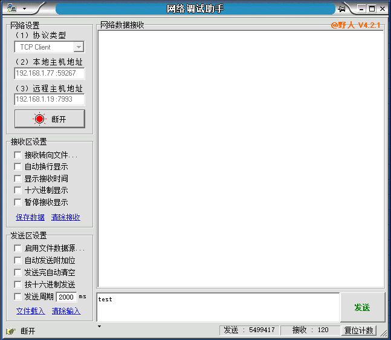
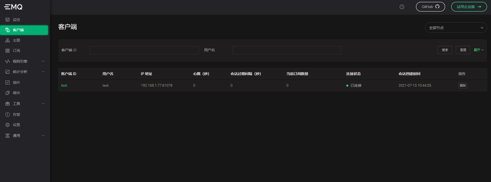
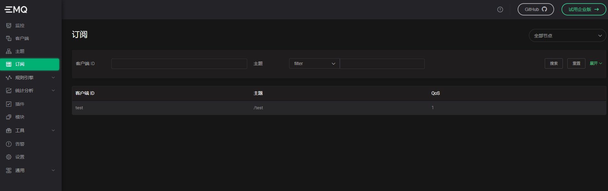
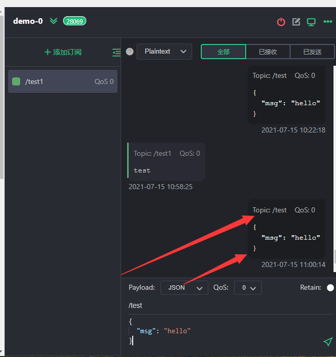
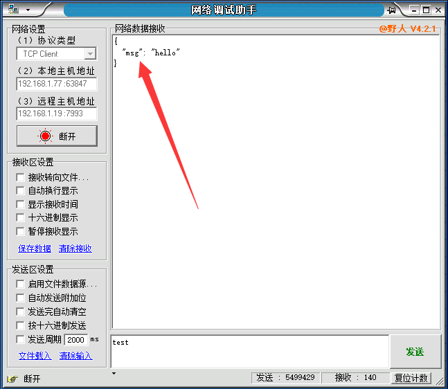
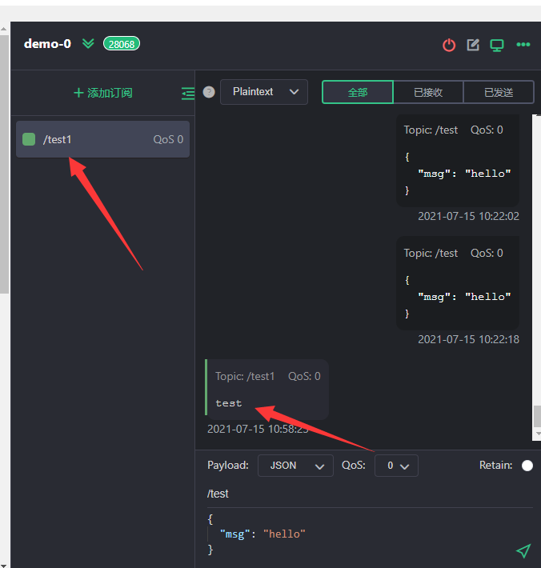

# Exproto-svr-python 快速指南

## 前提

1. 仅支持开源版 4.3+。
2. JDK 1.8 +
3. 目前官方的4.3.0-4.3.5的版本尚存在bug，需要补丁。以下是加入补丁之后的Demo。
4. 如果你使用的时候，官方还没有修复bug，可将[补丁](patch/grpc_client.beam)放到你Emqx的lib/grpc-0.6.2/ebin下。

## 创建python虚拟环境

本项目默认认为你的机器已经具有Python环境。

```bash
#mkvirtualenv 虚拟环境名称
mkvirtualenv testgrpc
```

我这里的虚拟环境名字是testgrpc，这个可以自定义。

## 使用虚拟环境

```bash
workon testgrpc
```

## 安装升级依赖

```sh
python3 -m pip install --upgrade pip
python3 -m pip install grpcio
python3 -m pip install grpcio-tools
```

## 创建Python项目

在你的工作空间 ,创建文件夹

```sh
mkdir Exproto-svr-python
cd Exproto-svr-python
mkdir protos
mkdir demo
```

目录结构如下：

```
Exproto-svr-python
├── protos
└── demo
```

## 导入官方的[exproto.proto](https://github.com/emqx/emqx/tree/master/apps/emqx_exproto/priv/protos) 

 在此处获取: [exproto.proto](https://github.com/emqx/emqx/tree/master/apps/emqx_exproto/priv/protos) ，下载完之后复制到Exproto-svr-python下的protos下

## 生成代码

然后需要通过GRPC的协议规范文件来生成代码,在demo下运行命令:

```sh
python3 -m grpc_tools.protoc -I../protos --python_out=. --grpc_python_out=. ../protos/exproto.proto
```

```
Exproto-svr-python
├── protos
|	├── exproto.proto
└── demo
    ├── exproto_pb2.py
    └── exproto_pb2_grpc.py
```

到此为止我们的项目结构搭建成功，这时候如果你的exproto_pb2_grpc.py文件可能有错误，那是因为包的位置不对，将 `import exproto_pb2 as exproto__pb2`改为`from demoimport exproto_pb2 as exproto__pb2`然后开始编写测试 GRPC Server 端

## Demo

在demo目录下

```sh
mkdir main.py
vim main.py
```

源码如下

```python
# author：wangscaler
# date: 2021.07.14 19:03
from concurrent import futures
import logging
import grpc
from demo import exproto_pb2_grpc
from demo import exproto_pb2

logging.getLogger().setLevel(logging.INFO)


class ConnectionHandlerServicer(exproto_pb2_grpc.ConnectionHandlerServicer):
    # 这里替换成你的EMQX的IP地址
    channel = grpc.insecure_channel('192.168.1.19:9100')
    stub = exproto_pb2_grpc.ConnectionAdapterStub(channel)

    def OnSocketCreated(self, request_iterator, context):
        for request in request_iterator:
            logging.info("[LOG] 客户端 SOCKET 连接: ")
            logging.info(request)
            # EMQX认证
            info = exproto_pb2.ClientInfo(username="test", clientid="test")
            auth = exproto_pb2.AuthenticateRequest(clientinfo=info, password="test", conn=request.conn)
            auth_response = self.stub.Authenticate(auth)
            logging.info("[LOG] authenticate code: " + str(auth_response.code))
            # 订阅主题
            subscribe = exproto_pb2.SubscribeRequest(conn=request.conn, qos=1, topic="/test")
            sub_response = self.stub.Subscribe(subscribe)
            logging.info("[LOG] subscribe code: " + str(sub_response.code))
            # 启动心跳检测interval*3s
            timer = exproto_pb2.TimerRequest(conn=request.conn, type=exproto_pb2.TimerType.KEEPALIVE, interval=20)
            timer_response = self.stub.StartTimer(timer)
            logging.info("[LOG] Timer code: " + str(timer_response.code))
        return exproto_pb2.SocketCreatedRequest()

    def OnReceivedBytes(self, request_iterator, context):
        # 将tcp连接发送的数据发布
        for request in request_iterator:
            data = request.bytes.decode('utf-8')
            logging.info("[LOG] ReceivedBytesRequest：" + data)
            # 发布消息
            publish = exproto_pb2.PublishRequest(conn=request.conn, topic="/test1", qos=1, payload=request.bytes)
            response = self.stub.Publish(publish)
            logging.info("[LOG] publish code: " + str(response.code))
        return exproto_pb2.ReceivedBytesRequest()

    def OnSocketClosed(self, request_iterator, context):
        for request in request_iterator:
            logging.info("[LOG] onSocketClosed:")
            logging.info(request)
        return exproto_pb2.SocketClosedRequest()

    def OnTimerTimeout(self, request_iterator, context):
        for request in request_iterator:
            logging.info("[LOG] OnTimerTimeout:")
            logging.info(request)
            # 关闭心跳超时的连接
            close = exproto_pb2.TimerTimeoutRequest(conn=request.conn, type=exproto_pb2.TimerType.KEEPALIVE)
            response = self.stub.Close(close)
            logging.info("[LOG] close:" + str(response.code))
        return exproto_pb2.TimerTimeoutRequest()

    def OnReceivedMessages(self, request_iterator, context):
        # 将EMQX收到的消息发送
        for request in request_iterator:
            logging.info("[LOG] OnReceivedMessages:")
            logging.info(request)
            message = request.messages[0]
            send = exproto_pb2.SendBytesRequest(conn=request.conn, bytes=message.payload)
            response = self.stub.Send(send)
            logging.info("[LOG] sendbytes:" + str(response.code))
        return exproto_pb2.ReceivedMessagesRequest()


def serve():
    server = grpc.server(futures.ThreadPoolExecutor(max_workers=10))
    exproto_pb2_grpc.add_ConnectionHandlerServicer_to_server(
        ConnectionHandlerServicer(), server)
    server.add_insecure_port('[::]:9001')
    server.start()
    server.wait_for_termination()


if __name__ == '__main__':
    logging.basicConfig()
    serve()

```
## 测试过程
我这里使用的网络调试助手进行的测试，EMQX服务器的IP:192.168.1.19

### 连接




连接之后可以看到控制台输出以下内容：

```
INFO:root:[LOG] 客户端 SOCKET 连接: 
INFO:root:conn: "g1hkAA5lbXF4QDEyNy4wLjAuMQAAC7kAAAAAAAAAAQ=="
conninfo {
  peername {
    host: "192.168.1.77"
    port: 59267
  }
  sockname {
    host: "192.168.1.19"
    port: 7993
  }
}
```

截图如下：


### 认证

控制台会输出

```
INFO:root:[LOG] authenticate code: 0
```

此时观察EMQX



### 订阅

控制台输出

```java
INFO:root:[LOG] subscribe code: 0
```

此时观察EMQX



当我们给该主题发送消息的时候。



我们的控制台打印

```java
INFO:root:[LOG] OnReceivedMessages:
INFO:root:conn: "g1hkAA5lbXF4QDEyNy4wLjAuMQAADX4AAAAAAAAAAQ=="
messages {
  node: "emqx@127.0.0.1"
  id: "0005C720BB1F52D1F44000000CAF0009"
  from: "demo-0"
  topic: "/test"
  payload: "{\n  \"msg\": \"hello\"\n}"
  timestamp: 1626318275826
}

INFO:root:[LOG] sendbytes:0
```

同时我们的网络助手也收到了消息。



### 开启定时器

控制台输出

```
INFO:root:[LOG] Timer code: 0
```

如果你连接上没发消息，根据配置文件`exproto.listener.protoname.idle_timeout = 30s`，30s会自动踢掉连接，如果你的interval设置在10以下，能看到效果，如果设置在10以上，需要发送一条消息，再观察。我这里设置的5，意思就是15s后回调OnTimerTimeout

15s后控制台输出

```java
INFO:root:[LOG] OnTimerTimeout:
INFO:root:conn: "g1hkAA5lbXF4QDEyNy4wLjAuMQAADIAAAAAAAAAAAQ=="

INFO:root:[LOG] close:0
INFO:root:[LOG] onSocketClosed:
INFO:root:conn: "g1hkAA5lbXF4QDEyNy4wLjAuMQAADIAAAAAAAAAAAQ=="
reason: "{shutdown,{sock_closed,normal}}"
```

### 发布

当我们使用网络调试助手发送消息(test)时，控制台输出

```java
INFO:root:[LOG] ReceivedBytesRequest：test

INFO:root:[LOG] publish code: 0
```

而我们的订阅者，也能收到信息。



### 关闭

控制台打印

```java
INFO:root:[LOG] onSocketClosed:
INFO:root:conn: "g1hkAA5lbXF4QDEyNy4wLjAuMQAADawAAAAAAAAAAQ=="
reason: "{shutdown,{sock_closed,tcp_closed}}"

```

## 参考资料
- [1] [exproto-svr-java-for-enterpise-e4.2](https://github.com/emqx/emqx-extension-examples/tree/master/exproto-svr-java-for-enterpise-e4.2)
- [2] [gRpc.io](https://www.grpc.io/docs/languages/python/quickstart/)
## 注意：这里的StartTimer官方文档写的开启心跳的定时器，其真实意义是如果监测到我们的tcp连接interval*3s没有发送数据，就会回调OnTimerTimeout函数，我们可以在这里处理一些业务，我这里将tcp连接直接踢掉。